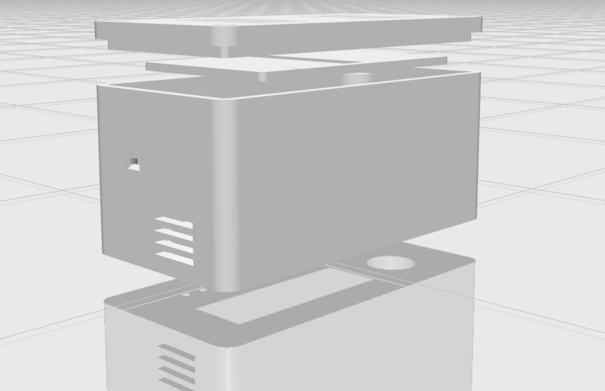

# weatherSTA

# Weather Station and Clock with ESP32, BME280, SCD40 and OpenWeather API

This project is a versatile weather station and clock, designed to run on an ESP32 using the Arduino framework and FreeRTOS. It measures and displays indoor environmental data in real-time, as well as outdoor weather data through the OpenWeather API. This project is designed to be user-friendly, energy-efficient, and highly customizable.


Dashboard example            |  Enclosure
:-------------------------:|:-------------------------:
  |  


## Features

1. **Two Operating Modes**: The system operates in two distinct modes - Clock Mode and Station Mode.
   - **Clock Mode**: Displays indoor environment data (temperature, humidity, CO2 concentration) and the current time. The time is fetched using the NTP protocol.
   - **Station Mode**: Cycles through displaying indoor data, current outdoor data from the OpenWeather API, and outdoor forecast data. After cycling, the system goes idle for a configurable duration, shuts down, and then restarts.
   
2. **Energy Efficiency**: The system uses a PIR sensor to detect human presence and manage the LCD backlight, reducing power consumption. The PIR sensor's duration is configurable.

3. **Connectivity**: The system connects to WiFi using WiFiManager. It also has a built-in web server displaying all the data and allowing mode switching and parameter adjustments.

4. **Visual Indicators**: The system includes three LEDs indicating rain (from current weather data), hot (indoor temperature above 24°C), and cold conditions.

5. **Audible Indicators**: A buzzer provides hourly chimes, with a long chime at 12 am and pm. The system stops making noise from 2 am to 6 am to minimize disturbance.

6. **InfluxDB Integration**: The system pushes data to an InfluxDB server every 10s for storage and visualization on a pre-configured InfluxDB dashboard.

7. **User Interface**: A multipurpose button allows system configuration without needing to access the web-based interface.

8. **Enclosure**: The project includes STL files for a 3D printable enclosure measuring 7.00 x 14.00 x 9.00 cm.

## Sensors Used

1. BME280 Sensor: Used for measuring indoor temperature, humidity, and pressure.
2. SCD40 Sensor: Used for measuring indoor CO2 concentration.

## Libraries Used

```
1. Adafruit BME280 Library
2. Adafruit Unified Sensor
3. LiquidCrystal_I2C
4. ESP Async WebServer
5. ArduinoJson
6. Adapted from [ebutton](https://github.com/jonnieZG/EButton) 1.2.0 (2019)
7. WiFiManager
8. ESP32Time
9. Sensirion I2C SCD4x
10.ESP8266 Influxdb
```

## Project Tree

```
.
├── data
│   ├── favicon.png
│   ├── index.htm
│   ├── jquery-3.6.0.min.js
│   ├── script.js
│   └── w3.css
├── img
│   ├── clock_mode.png
│   ├── dashboard.png
│   └── enclosure.png
├── include
│   ├── btn.h
│   ├── cred.h
│   ├── others.h
│   └── README
├── influx_dashboard
│   └── STA_dashboard.json
├── lib
│   └── README
├── platformio.ini
├── README.md
├── src
│   ├── btn.cpp
│   ├── main.cpp
│   └── others.cpp
├── STL_file
│   └── enclosure.stl
└── test
    ├── README
    └── test_main.cpp
```

## Getting Started

Users must create a `cred.h` file with the following definitions:

```cpp
#define INFLUXDB_TOKEN ""
#define INFLUXDB_ORG ""
```

These values should be obtained from your InfluxDB instance.

Build the filesystem image, the firmware and upload them to the ESP32.

Boot the ESP and connect to the created WIFI network `"STA esp"`. The password is in the ```others.cpp``` file and can me modified.

Connect the ESP to the desired WIFI network, and proceed to enter the required parameters and then reboot. `Voilà`.

## Wirings
| Module | Connection |
|--------|---------|
| LCD 16x2 |  I2C  |
| BME280 |  I2C  |
| SCD40  |  I2C  |
| LED cold  |  D19  |
| LED hot   |  D18  |
| LED rain  |  D5  |
| BTN  |  D27  |
| Buzzer  |  D2  |
| PIR  |  D17  |

## MISC
WIFI connection lost: `LED cold` and `LED hot` blink for 5s.

### Config Menu: 
`CLOCK mode {ON/OFF}`, `LCD Speed 250-500(ms)`, `Sleep T 30-60(s)`, `Deep-sleep T 15-60(mins)`,`Am/PM {AM/PM}`, `Chg WLAN {ON/OFF}`


## Future Work

### TODO
- [ ] Include the influx db token and ORG in the system config file through WiFiManager
- [ ] Include the NTP servers, timezone in the config file too
- [ ] Reduce the filesystem size by checking the CSS and JS coverage
- [ ] OTA updates

While the system is functional and robust, future improvements could include adding more sensors for additional environmental data, improving the user interface, and optimizing power management.

