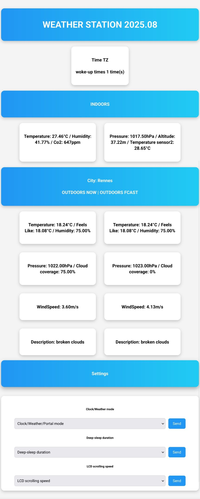

# weatherSTA

# Weather Station and Clock with ESP32, BME280, SCD40 and OpenWeather API

This project is a weather station and clock, that runs on an `ESP32` using the `Arduino` framework and `FreeRTOS`. It measures and displays indoor environmental data in real-time, as well as outdoor weather data through the OpenWeather API.


Dashboard example            |  Enclosure: Box | Enclosure: Lid
:-------------------------:|:-------------------------:|-------------------------:
  |   |  

<details>
<summary>Click to view the results displayed on the browser</summary>



</details>

## Getting Started

> [!IMPORTANT]
> Download the already compiled firmware(`.hex, .bin, the partitions.bin and the spiffs`) from the `release page` and flash it to your `ESP32`. 
>
> Alternatively, you can build it from source by yourself.
>
> Boot the ESP and connect to the created WIFI network `"STA esp"`. The default password (`P@55w0rd`) is in the `configs.hpp` header file.
>
> Connect the ESP to the desired WIFI network in the wifimanager portal, then reboot to validate the access point. After that, you'll have to reconnect to the portal in the `setup` page, to enter the required configuration parameters. After that, the esp will reboot and you'll be all set. `Voilà`.

### Build Steps
```bash
# build and upload file system
platformio run --target uploadfs -e esp32dev
# build and upload firmware
platformio run --target upload -e esp32dev 
```

> [!NOTE]
> You can access the web server via `http://weather_sta.local` or by looking up the ip addressed assigned to the esp32 and going to `http://[ip_addr]`
>
> Many of the configuration options can be modified in the `configs.hpp`. Such as timing related, `ntp` servers and `timezone` etc.
>
> Almost the essentials configs can be done dynamically. After the firmware has been built, you can use the wifi manager portal to set the value as you wish.

### OTA Updates
You can upload a new firmware through `WiFiManager` at `http://[ip_addr]/update`. You can enable the `on-demand` portal using the physical `button` connected to the `pin27`, and navigate to `Chg WLAN` and set it to `Yes`.

## Features

**Two Operating Modes**: The system operates in two distinct modes - Clock Mode (default) and Station Mode.
   - **Clock Mode**: Displays indoor environment data (temperature, humidity, CO2 concentration) and the current time. The time is fetched using the NTP protocol.
   - **Station Mode**: Cycles through displaying indoor data, current outdoor data from the OpenWeather API, and outdoor forecast data. After cycling, the system goes idle for a configurable duration, shuts down, and then restarts.


> [!NOTE]
> The system uses a PIR sensor to detect human presence and manage the LCD backlight, reducing power consumption. The PIR sensor's duration is configurable.
>
> The system connects to WiFi using WiFiManager with local webserver
>
> Three LEDs indicating rain (from current weather data), hot (indoor temperature above 24°C), and cold conditions.
>
> A buzzer provides hourly chimes, with a long chime at 12 am and pm. It stops making noise from 2 am to 6 am.
>
> InfluxDB integration: pushes every 10s data that can be visualized using the provided dashboard (see influx_dashboard)
> STL files for a 3D printable enclosure.

## Main Sensors

1. BME280 Sensor: Used for measuring indoor temperature, humidity, and pressure.
2. SCD40 Sensor: Used for measuring indoor CO2 concentration.

## Libraries Used

More in `platformio.ini` file.

## Wirings
| Module | Connection |
|--------|---------|
| LCD 16x2 |  I2C  |
| BME280 |  I2C  |
| SCD40  |  I2C  |
| LED cold  |  D19  |
| LED hot   |  D18  |
| LED rain  |  D5  |
| BTN  |  D27  |
| Buzzer  |  D2  |
| PIR  |  D17  |

## MISC
WIFI connection lost: `LED cold` and `LED hot` blink for 5s.

### Config Menu: 
`CLOCK mode {ON/OFF}`, `LCD Speed 250-500(ms)`, `Sleep T 30-60(s)`, `Deep-sleep T 15-60(mins)`,`Am/PM {AM/PM}`, `Chg WLAN {ON/OFF}`


### TODO
- [ ] Outdoors air quality metrics
- [ ] Add target for other esp version
