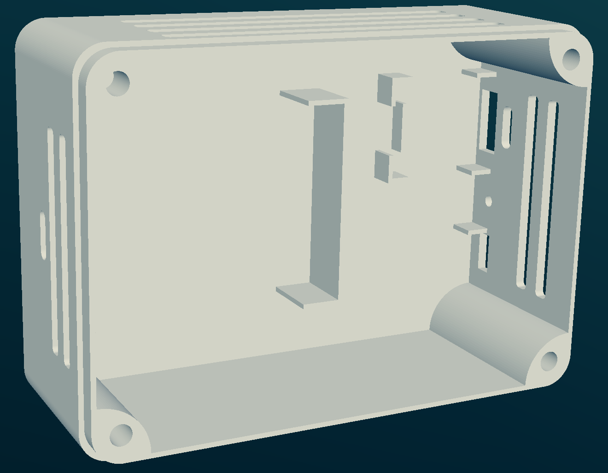
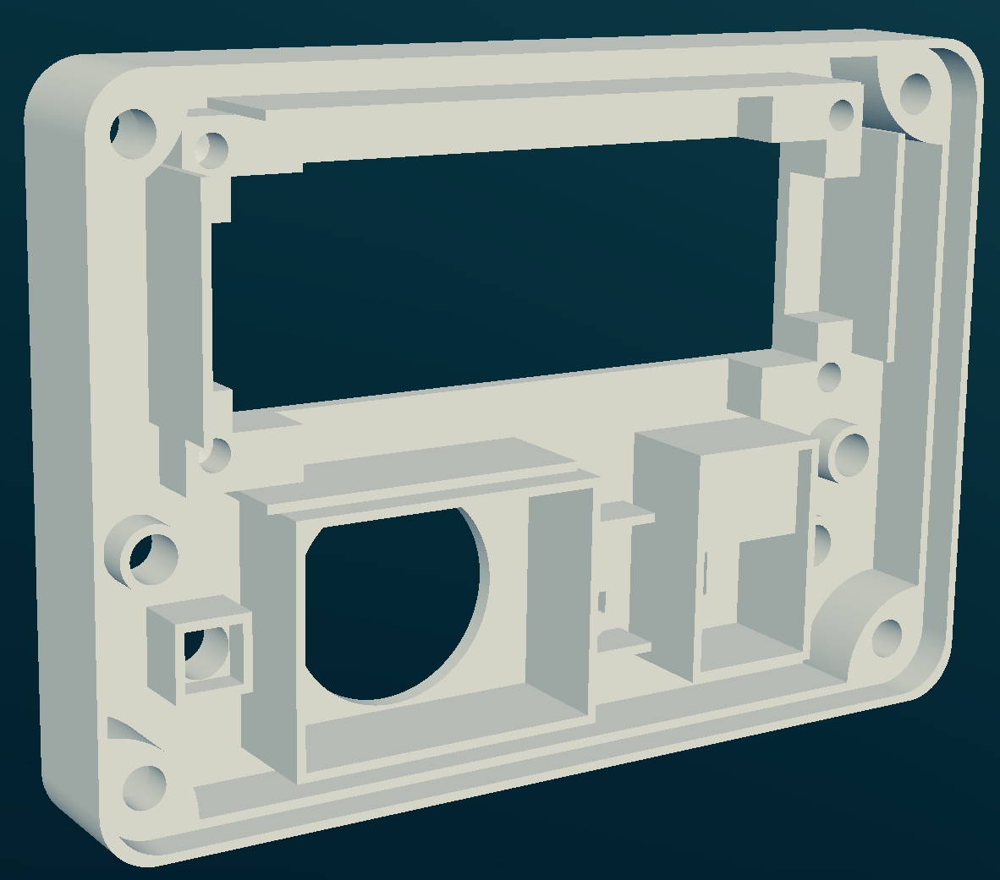

# weatherSTA

# Weather Station and Clock with ESP32, BME280, SCD40 and OpenWeather API

This project is a weather station and clock, that runs on an `ESP32` using the `Arduino` framework and `FreeRTOS`. It measures and displays indoor environmental data in real-time, as well as outdoor weather data through the OpenWeather API.


Dashboard example            |  Enclosure: Box | Enclosure: Lid
:-------------------------:|:-------------------------:|-------------------------:
  |   |  

## Getting Started

> [!IMPORTANT]
> Build the filesystem image, the firmware and upload them to the ESP32. You can also simply download the firmware from the build artifact and flash it.
>
> Boot the ESP and connect to the created WIFI network `"STA esp"`. The default password is in the ```others.cpp``` (`P@55w0rd`).
>
> Connect the ESP to the desired WIFI network, and proceed to enter the required parameters and then reboot. `Voilà`.


> [!NOTE]
> You can access the web server via `http://weather_sta.local` or by looking up the ip addressed assigned to the esp32 and going to `http://[ip_addr]`

## Features

**Two Operating Modes**: The system operates in two distinct modes - Clock Mode (default) and Station Mode.
   - **Clock Mode**: Displays indoor environment data (temperature, humidity, CO2 concentration) and the current time. The time is fetched using the NTP protocol.
   - **Station Mode**: Cycles through displaying indoor data, current outdoor data from the OpenWeather API, and outdoor forecast data. After cycling, the system goes idle for a configurable duration, shuts down, and then restarts.


> [!NOTE]
> The system uses a PIR sensor to detect human presence and manage the LCD backlight, reducing power consumption. The PIR sensor's duration is configurable.
>
> The system connects to WiFi using WiFiManager with local webserver
>
> Three LEDs indicating rain (from current weather data), hot (indoor temperature above 24°C), and cold conditions.
>
> A buzzer provides hourly chimes, with a long chime at 12 am and pm. It stops making noise from 2 am to 6 am.
>
> InfluxDB integration: pushes every 10s data that can be visualized using the provided dashboard (see influx_dashboard)
> STL files for a 3D printable enclosure.

## Main Sensors

1. BME280 Sensor: Used for measuring indoor temperature, humidity, and pressure.
2. SCD40 Sensor: Used for measuring indoor CO2 concentration.

## Libraries Used

More in `platformio.ini` file.

## Project Tree

```
.
├── data
│   └── web server related files
├── img
│   └── images
├── include
│   ├── btn.h
│   ├── others.h
│   └── README
├── influx_dashboard
│   └── STA_dashboard.json
├── platformio.ini
├── README.md
├── src
│   ├── btn.cpp
│   ├── main.cpp
│   └── others.cpp
```

## Wirings
| Module | Connection |
|--------|---------|
| LCD 16x2 |  I2C  |
| BME280 |  I2C  |
| SCD40  |  I2C  |
| LED cold  |  D19  |
| LED hot   |  D18  |
| LED rain  |  D5  |
| BTN  |  D27  |
| Buzzer  |  D2  |
| PIR  |  D17  |

## MISC
WIFI connection lost: `LED cold` and `LED hot` blink for 5s.

### Config Menu: 
`CLOCK mode {ON/OFF}`, `LCD Speed 250-500(ms)`, `Sleep T 30-60(s)`, `Deep-sleep T 15-60(mins)`,`Am/PM {AM/PM}`, `Chg WLAN {ON/OFF}`


### TODO
- [x] Include the influx db token and ORG in the system config file through WiFiManager
- [x] Include the NTP servers, timezone in the config file too
- [ ] Reduce the filesystem size by checking the CSS and JS coverage
- [ ] OTA updates

